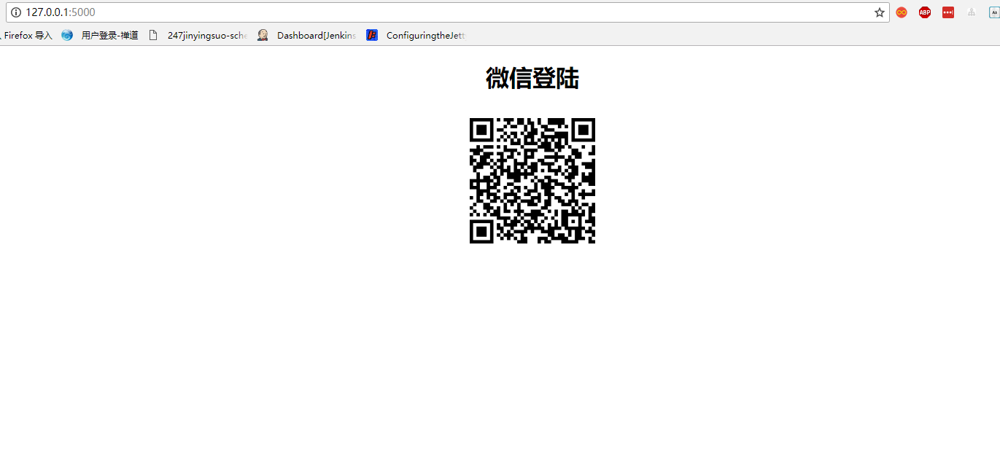
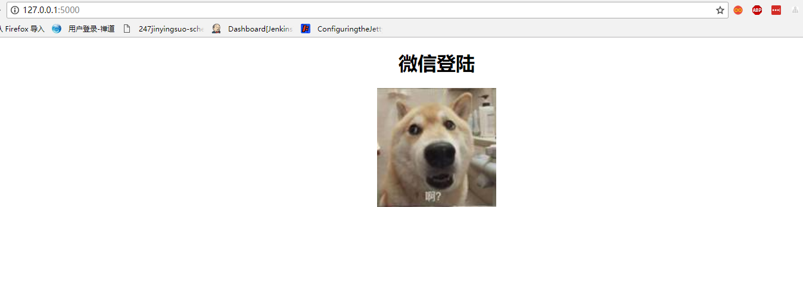
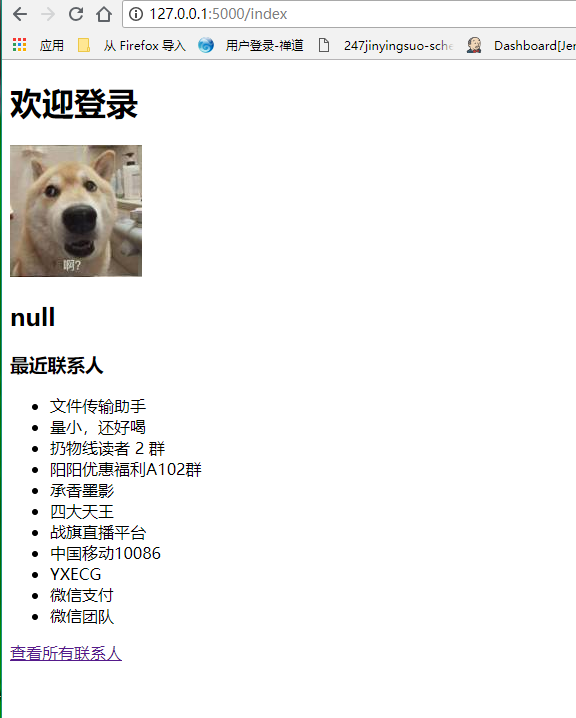
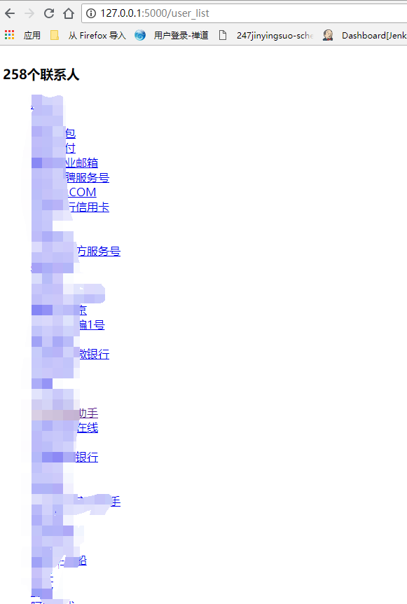

### 说明
1.程序启动后，在浏览器输入http://127.0.0.1:5000/ 回车开始

2.扫码登录后显示用户昵称和头像以及最近联系人列表，新注册的微信用户不能使用web版微信，程序会有提示

3.点击所有联系人链接，进入全部联系人列表

4.点击需要聊天的好友昵称，进入发送信息页面，在输入框输入要发送的内容，点发送按钮，好友微信会收到相应的消息

5.在其他客户端给当前用户发送消息，控制台会打印出发送者和接收者的用户名以及发送的信息

### 示例

